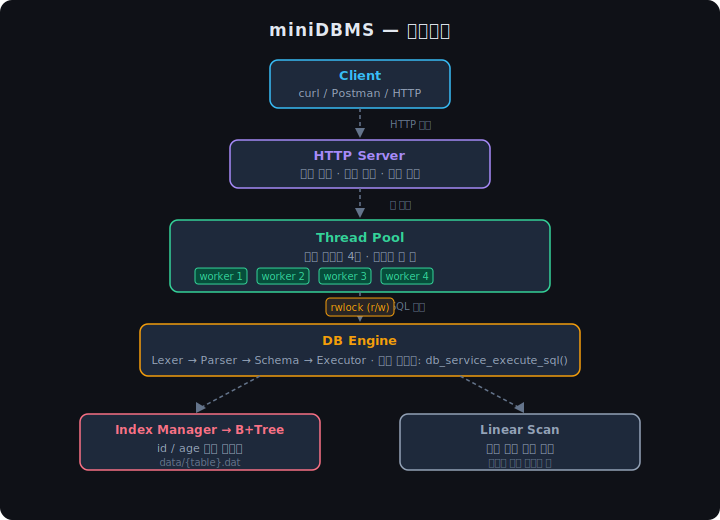
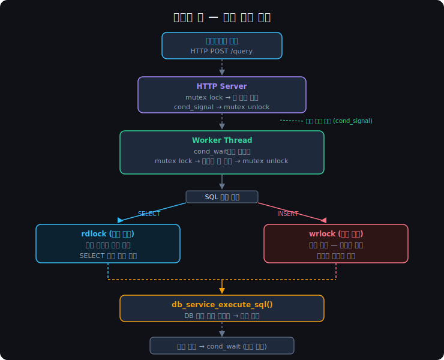

# miniDBMS

> C로 구현한 파일 기반 SQL 실행기 + 스레드 풀 HTTP API 서버

---

## 프로젝트 소개

SQL 처리기와 B+Tree 인덱스를 처음부터 직접 구현하고, 그 위에 스레드 풀 기반 HTTP 서버를 얹어 외부 클라이언트에서 SQL을 요청할 수 있는 미니 DBMS입니다.

- 지원 SQL: `INSERT`, `SELECT` (단건 / 범위 / 전체 스캔)
- 인덱스: `id`, `age` 기준 B+Tree
- 동시성: 스레드 풀 + rwlock으로 SELECT 병렬 처리
- 구현 언어: C

---

## 아키텍처



서버와 엔진은 `db_service_execute_sql()` 하나로만 연결됩니다. 스레드는 이 함수를 통해서만 엔진에 접근하며, Executor는 B+Tree를 직접 건드리지 않고 Index Manager를 통해서만 접근합니다.

---

## 스레드 풀

### 개념

스레드 풀은 미리 만들어둔 고정 개수의 스레드가 잡 큐에서 작업을 꺼내 처리하는 구조입니다. 요청마다 스레드를 새로 생성하고 파괴하는 비용을 없애고, 동시에 처리할 수 있는 요청 수를 워커 수로 제한해 서버를 안정적으로 유지합니다.

| 개념 | 설명 |
|------|------|
| 워커 스레드 | 잡 큐에서 작업을 꺼내 실행하는 스레드. 서버 시작 시 고정 개수(4개) 생성 |
| 잡 큐 | 링버퍼(ring buffer) 구조. 요청이 들어오면 큐에 적재, 워커가 순서대로 소비 |
| mutex | 큐 접근 보호. 여러 스레드가 동시에 큐를 건드리지 못하도록 잠금 |
| cond_wait | 잡이 없을 때 워커를 재움. 잡이 들어오면 signal로 깨움 |
| rwlock | 엔진 접근 보호. SELECT는 동시 읽기 허용, INSERT는 단독 쓰기 |

### 요청 처리 흐름



### 워커 스레드 대기 구조

워커는 잡이 없을 때 `pthread_cond_wait`으로 실제로 잠듭니다. 루프를 돌며 CPU를 태우는 스핀락이 아닙니다.

```c
while (tp->queue_count == 0 && !tp->stop)
    pthread_cond_wait(&tp->cond_not_empty, &tp->mutex);
```

### 엔진 접근 — rwlock

| 요청 | Lock | 동작 |
|------|------|------|
| SELECT | rdlock | 여러 스레드 동시 처리 가능 |
| INSERT | wrlock | 단독 쓰기, 나머지 대기 |

---

## 빌드 및 실행

```bash
make                        # 빌드
./minidbms_server           # 서버 실행 (포트 8080)
make test                   # 단위 테스트 전체 실행
./test_threadpool 64        # 스레드 풀 병렬성 테스트
```

---

## 성능 비교

### 스레드 풀 speedup

```bash
./test_threadpool 64
```

```
workers  elapsed(ms)  speedup
-------  -----------  -------
1                480   1.00x
2                245   1.96x
4                125   3.84x
```

### B+Tree vs 선형 탐색

| 조건 | access_path | elapsed_ms | tree_io |
|------|-------------|------------|---------|
| `WHERE id = 5001` | `index:id:eq` | 0.136 | 2 |
| `WHERE age = 25` | `linear` | 0.636 | 0 |

---

## 테스트 케이스

| 구분 | 테스트 | 검증 내용 |
|------|--------|-----------|
| Thread Pool | 병렬 처리 | N개 잡을 worker 수별로 실행 → elapsed 감소, speedup 수치 확인 |
| Thread Pool | 안전 종료 | `threadpool_destroy()` 후 모든 워커 정상 종료 |
| Executor | INSERT | row 파일 기록, 인덱스 등록 |
| Executor | SELECT (index) | `index:id:eq`, `index:id:range`, `index:age:range` 결과 정확성 |
| Executor | SELECT (linear) | 인덱스 조건 외 쿼리 → 전체 스캔, 결과 일치 |
| Executor | 경로 일치 | 동일 쿼리를 인덱스/linear 두 경로로 실행 → 결과 동일 |
| B+Tree | 삽입 / 조회 | 삽입 후 단건·범위 조회 값 일치 |
| B+Tree | 노드 분할 | leaf 꽉 참 → 분할 후 height 증가, 기존 키 정상 조회 |

---

## 엣지 케이스

| 구분 | 상황 | 처리 방식 |
|------|------|-----------|
| Thread Pool | 잡 큐 포화 | `threadpool_submit()` 0 반환, 잡 버림 |
| Thread Pool | 종료 시 잠든 워커 | `cond_broadcast()`로 전체 깨운 후 join |
| B+Tree | 중복 키 (age) | 같은 key, 다른 offset → offset 오름차순 정렬 저장 |
| B+Tree | 노드 분할 후 탐색 | 분할 전 키 모두 정상 조회 |
| Executor | 빈 SQL / 잘못된 SQL | `BAD_REQUEST` 반환, 서버 크래시 없음 |
| HTTP | 미등록 라우트 | `{ "ok": false, "code": "UNSUPPORTED_ROUTE" }` 반환 |
